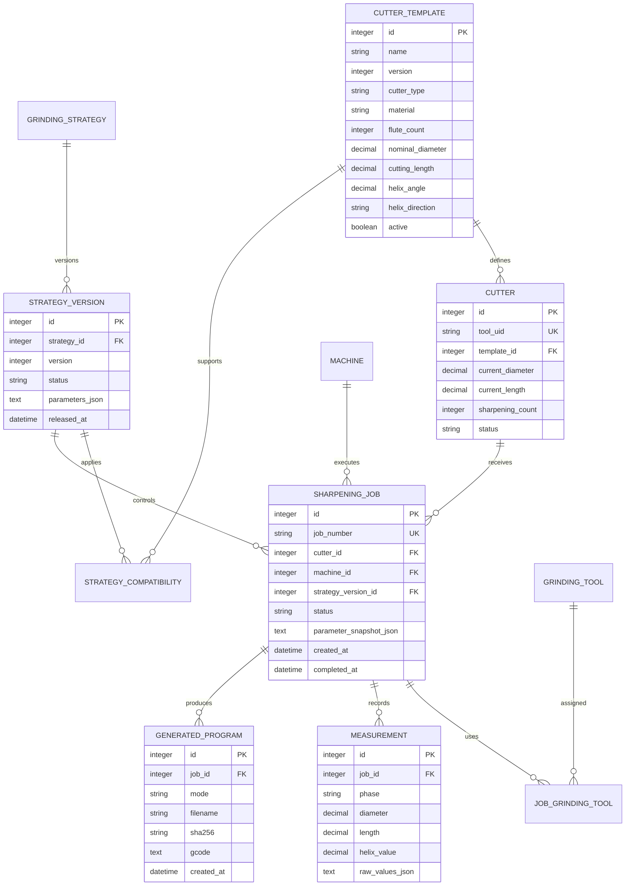
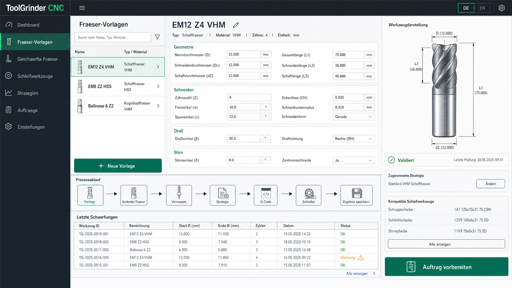

# ToolGrinder Datenbank- und Bedienkonzept

## Entscheidung

Die JSON-Dateien werden nicht sofort abgeschafft. Sie bleiben vorerst:

- kompatibles Import- und Exportformat
- interne Übergabe an die vorhandenen Generatorfunktionen
- lesbare Sicherung einzelner Datensätze

In der Weboberfläche wird JSON jedoch nicht mehr direkt bearbeitet. Die
Bedienung erfolgt über strukturierte, zweisprachige Formulare. Eine lokale
SQLite-Datenbank wird die führende Datenquelle der Webanwendung.

Damit bleibt die bewährte G-Code-Erzeugung zunächst unverändert, während die
Datenhaltung und Bedienung schrittweise verbessert werden.

## Fachliche Trennung

### Fräser-Vorlage

Beschreibt einen Fräsertyp, nicht ein konkretes physisches Werkzeug:

- Bezeichnung und Werkzeugart
- Material
- Nenndurchmesser und Schaftdurchmesser
- Gesamt-, Schneiden- und Schaftlänge
- Schneidenzahl
- Drallrichtung und Drallwinkel
- Stirngeometrie und weitere Konstruktionsmerkmale
- erlaubte oder bevorzugte Schleifstrategien

Vorlagen sind dynamisch anlegbar, kopierbar, versionierbar und deaktivierbar.

### Konkreter Fräser

Beschreibt ein einzelnes physisches Werkzeug:

- eindeutige Werkzeug-ID
- zugehörige Vorlage und deren Version
- Hersteller-, Kunden- oder Lagerkennung
- aktueller Ist-Durchmesser und Ist-Länge
- Anzahl bisheriger Schärfungen
- Mindestmaße und Sperrstatus
- aktuelle Lagerposition
- vollständige Mess- und Bearbeitungshistorie

Der konkrete Fräser verändert sich über seine Lebensdauer. Die Vorlage bleibt
dagegen die geometrische Referenz.

### Schleifwerkzeug

Beschreibt Schleifscheiben und Taster:

- eindeutige Werkzeug-ID
- Art, Form und Werkstoff
- Durchmesser, Breite und Bohrung
- Spindel- und Werkzeugnummer
- zulässige Drehzahl
- aktueller Verschleiß beziehungsweise Restmaß
- Korrekturwerte
- kompatible Maschinen und Strategien
- aktiv, gesperrt oder in Wartung

### Schleifstrategie

Eine Strategie ist eine versionierte Bearbeitungsvorschrift:

- G-Code-Modus: Umfang, Stirn, Vermessen oder Kombination
- Zustellungen, Vorschübe, Drehzahlen und Rückzüge
- Reihenfolge der Operationen
- Auswahlregeln für Schleifwerkzeuge
- Geometrieformeln und Sicherheitsabstände
- erlaubte Werkzeugarten und Materialien
- Freigabestatus: Entwurf, geprüft oder freigegeben

Eine freigegebene Strategieversion darf nicht still verändert werden. Änderungen
erzeugen eine neue Version. So bleibt später nachvollziehbar, womit ein Fräser
tatsächlich geschärft wurde.

### Schärfauftrag

Der Auftrag verbindet alle Daten für einen konkreten Lauf:

- konkreter Fräser
- Maschinenkonfiguration
- Strategieversion
- verwendete Schleifwerkzeuge
- Eingangsvermessung
- Zielmaße
- erzeugter G-Code mit Prüfsumme
- Bedienerfreigabe und Zeitpunkte
- Ergebnisvermessung
- Warnungen, Abbruchgrund und Abschlussstatus

Nach dem Start werden die verwendeten Parameter als Snapshot gespeichert. Ein
späteres Ändern der Vorlage oder Strategie darf alte Aufträge nicht verändern.

## Vorgeschlagenes Datenmodell

Flexible Strategie- und Messdetails dürfen intern JSON-Felder verwenden. Diese
Felder sind ein Implementierungsdetail der Datenbank und werden nicht als
Rohtext in der normalen Bedienoberfläche gezeigt.

## Bedienablauf

1. Fräser-Vorlage auswählen oder anlegen.
2. Konkreten Fräser über Werkzeug-ID auswählen oder aus Vorlage erzeugen.
3. Eingangsmaße laden oder mit LinuxCNC vermessen.
4. Passende freigegebene Strategie vorschlagen lassen.
5. Schleifwerkzeuge auswählen und deren Verfügbarkeit prüfen.
6. Zielmaße und Sicherheitsprüfung bestätigen.
7. G-Code aus einem unveränderlichen Auftrags-Snapshot erzeugen.
8. Simulation oder Dry Run dokumentieren.
9. Bearbeitung durchführen.
10. Ergebnis vermessen und Werkzeugzustand aktualisieren.

## Zweisprachigkeit

Datenbankschlüssel bleiben sprachneutral und stabil. Übersetzt werden:

- Navigation und Feldbezeichnungen
- Hilfetexte
- Validierungs- und Fehlermeldungen
- Statusbezeichnungen
- Einheitenbeschreibungen und Bedienhinweise

Benutzerinhalte wie Werkzeugname, Kundenkennung oder Notizen werden nicht
automatisch übersetzt. Für fachliche Katalogtexte können optionale Felder wie
`name_de` und `name_en` verwendet werden.

## Sicherheitsregeln

- Maschinenlimits gehören zur Maschine, nicht zur Fräser-Vorlage.
- Bewegungsparameter werden weiterhin unmittelbar vor der G-Code-Erzeugung
  validiert.
- Freigegebene Strategieversionen sind unveränderlich.
- Jeder Auftrag speichert vollständige Parameter-Snapshots.
- G-Code wird mit Prüfsumme und Generatorversion archiviert.
- Löschen wird für Historiedaten durch Deaktivieren oder Archivieren ersetzt.
- Datenbankmigrationen werden versioniert und gesichert.
- SQLite-Zugriffe nutzen Transaktionen, Fremdschlüssel und WAL-Modus.

## Migrationsplan

### Phase 1: Bedienkonzept und Kompatibilität

- JSON-Editor aus der Standardansicht entfernen.
- JSON nur in einem Expertenbereich als Import/Export anbieten.
- bestehende Generatoren weiterhin mit zusammengesetzten Python-Dictionaries
  aufrufen.

### Phase 2: Stammdaten

- SQLite-Schema und Migrationen einführen.
- Maschinen, Fräser-Vorlagen, konkrete Fräser und Schleifwerkzeuge verwalten.
- vorhandene `ToolLib/*.json` einmalig importieren.

### Phase 3: Strategien und Aufträge

- versionierte Schleifstrategien einführen.
- Auftragsassistent mit Parameter-Snapshot bauen.
- G-Code und Prüfsummen je Auftrag archivieren.

### Phase 4: Messhistorie und Lebenslauf

- Eingangs- und Ergebnismessungen speichern.
- Werkzeuglebenslauf und Mindestmaßprüfung ergänzen.
- Wiederholaufträge aus erfolgreichen historischen Aufträgen ermöglichen.

## Grafischer Entwurf

Der Entwurf ist eine Informationsarchitektur, keine endgültige Feldfreigabe.
Vor der Implementierung müssen die tatsächlichen Fräsergeometrien,
Schleifwerkzeugtypen und Strategieregeln gemeinsam festgelegt werden.
